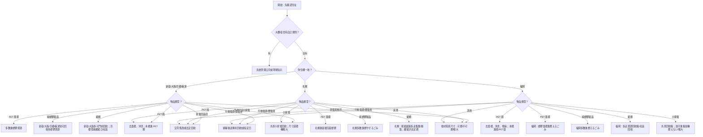

# 日本垃圾分類制度比較報告

## 執行摘要

日本家庭垃圾制度的核心，不是「全國統一」或「都道府縣統一」，而是**由市區町村依自身處理設施、回收體系與一般廢棄物處理計畫來決定**。因此，同樣是「塑膠盒」「乾電池」「玻璃杯」或「舊衣」，在不同城市可能落入完全不同的分類。環境省與法制資料都明確指出，一般廢棄物的處理責任在市町村，分別收集規則也因此出現地域差異；本報告以東京都的新宿區、大阪府的大阪市、京都府的京都市、北海道的札幌市、福岡縣的福岡市，再加上具代表性的橫濱市作為比較母體。citeturn29search6turn29search5turn29search1

對在日台灣人而言，最重要的不是死背日本全國規則，而是先抓住三個高風險差異。第一，**塑膠並不一定是資源**：新宿、京都、大阪、橫濱已把相當多的塑膠製品與容器包裝納入資源回收，但札幌仍以「容器包裝塑膠」為主，非包裝塑膠多數仍進可燃；福岡市則把多數塑膠容器、包材與一般塑膠製品放在「燃えるごみ」，只有部分塑膠品項能透過資源回收箱回收。第二，**垃圾袋制度差異非常大**：新宿、大阪、橫濱多採透明或半透明袋，家戶日常垃圾原則上不必用付費指定袋；京都、札幌、福岡則高度依賴指定袋，其中京都與福岡連資源類也有專用袋別。第三，**收運節奏差很多**：福岡市最特殊，家戶垃圾採夜間收運；札幌的不可燃多為四週一次；京都除週收塑膠、瓶罐 PET 外，還有月一次小型金屬、月兩次雜紙；新宿則是週二次可燃、週一次資源、月兩次金屬陶瓷玻璃。citeturn9search2turn21search2turn15search9turn26search2turn20search6turn19search5turn19search0turn19search2turn22search3turn28search0turn12search10

若只記一條實務原則，建議記成這句話：**先確認你的住址所屬自治體與社區規則，再看物品是「容器包裝」「一般產品」「帶電池的小家電」還是「法定回收大型家電」**。這比單純照材質猜分類更可靠。尤其是鋰電池、行動電源、可充電電池與帶電池的小家電，近年各市都把它們視為火災高風險物，處理方式明顯比過去更嚴格。citeturn32search0turn31search0turn21search2turn20search6turn30search2turn7search5

## 研究方法與閱讀前提

本報告的比較單位，採「**都道府縣代表城市**」而非抽象的都道府縣整體規則，原因是日本家庭垃圾分類在實務上以市區町村為核心。故本文以**東京都＝新宿區**、**大阪府＝大阪市**、**京都府＝京都市**、**北海道＝札幌市**、**福岡縣＝福岡市**，另加**橫濱市**作為代表性比較案例。這樣做最符合居民每天實際要面對的垃圾日曆、集積所規則、指定袋與回收點制度。citeturn29search6turn29search5

另外，日本還有一個外國人最容易忽略的現實：**大樓、社宅、學生宿舍、管理公司委外收運，可能與市政府對一般路邊集積所的規則不同**。京都市就明文提醒，若是由民間業者收運的公寓，可能不使用市府有料指定袋，而是依建物規則使用透明袋；大阪市也提醒，集合住宅與社區有時會自行進行古紙衣類自主回收；橫濱與札幌的古紙、古布也常透過社區集團回收而非市府例行門前收運。對租屋的台灣人來說，**「市政府規則」與「大樓管理規則」都要看，且以住處現場張貼的規則優先**。citeturn35search6turn15search2turn26search9turn34search0

本報告凡遇官方資料**未明確寫出**之處，會標示為「未明示」，並補上實務建議。另需注意，官方品目辭典大多假設「一般家庭使用、常見尺寸、未大量堆積、非事業廢棄物」；一旦物品過大、過重、含電池不可拆、含危險液體，或屬家電四品目、電腦、機車、建築廢材，就常改走粗大垃圾、拠點回收、零售店回收或法定回收流程。citeturn22search7turn31search4turn10search5turn10search9

## 跨區制度比較

### 差異總覽

六地制度最大的結構差異，可以概括成四句話。**新宿是「免費門前收運、分類細、塑膠資源化進步快」**；**大阪是「四大例行流向清楚、袋子不用買但分得細」**；**京都是「指定袋制度最明確、紙類與拠點回收體系強」**；**札幌是「可燃與不可燃要買袋，資源物免費但紙類與古著多靠集團或拠點」**；**福岡是「門前分類較少，但資源回收箱網絡很強，且夜間收運極具辨識度」**；**橫濱則是「塑膠資源化廣、電池類制度近年更新最快，且有明文化的過料制度」**。citeturn9search2turn15search9turn37search6turn12search10turn19search2turn26search2turn18search7

對台灣人最有感的差異，往往不是「可燃、不可燃」字面本身，而是**塑膠、紙類、電池與小家電**。台灣人容易把所有塑膠都想成可回收，但在日本這個直覺常常失準。京都、大阪、新宿、橫濱已把不少純塑膠製品納入資源；札幌仍將多數「產品塑膠」視為可燃；福岡則把 PET 以外多數塑膠包材與塑膠用品放進燃燒體系，僅另設拠點吸收部分資源物。紙類也不是到處都門前週收：新宿與大阪相對方便，京都有月二次雜紙加社區回收，橫濱與札幌、福岡則更多依賴社區或拠點。citeturn21search1turn35search8turn21search2turn20search7turn20search6turn19search5turn21search9turn15search2turn28search0turn34search1turn13search3

再者，**鋰電池與帶電池產品**已成為跨區共同的高風險品項。大阪已建立環境事業中心回收箱與到宅回收；福岡明言小型充電式電池與行動電源不可裝垃圾袋；新宿要求端子絕緣後依小型充電式電池規則排出；橫濱則已把相當範圍的電池類納入固定收集日。若無法確認，最安全做法幾乎永遠是：**先絕緣、不要拆壞、優先送官方或官方認可的回收點**。citeturn31search0turn30search2turn32search0turn7search5turn10search7

### 比較矩陣

| 地區 | 代表自治體 | 主要定期分類 | 收運頻率與時間 | 袋規則 | 外語與外國人友善 | 違規與處理 |
|---|---|---|---|---|---|---|
| 東京都 | 新宿區 | 資源、燃やすごみ、金属・陶器・ガラスごみ、粗大ごみ | 資源週 1、燃やす週 2、金屬陶瓷玻璃月 2、粗大須預約 | 家庭垃圾原則免費；以有蓋容器或中身可見袋排出；粗大有料 | 有英語、中文、韓文、越南語版手冊，並有外國人生活資訊頁與分類 App | 家戶違規個別罰則**未明示**；粗大需事前申請，家電四品目不收運 | citeturn8search3turn22search3turn8search1turn22search7turn8search2turn9search1 |
| 大阪府 | 大阪市 | 普通ごみ、資源ごみ、プラスチック資源、古紙・衣類、粗大ごみ | 普通週 2、資源週 1、塑膠週 1、古紙衣類週 1、粗大須預約 | 透明或半透明袋；每次收集約 3 袋 45L 為目安；日常家庭垃圾無付費指定袋 | 有英語、中文簡體、韓/朝鮮語、越南語、尼泊爾語版；有分別 App | 家戶分別過料**未明示**；粗大有料；鋰電池另有拠點與訪問回收 | citeturn15search9turn15search2turn15search3turn31search4turn36search0turn31search0 |
| 京都府 | 京都市 | 燃やすごみ、缶・びん・ペットボトル、プラスチック類、小型金属類、雑がみ、古着類、粗大ごみ | 燃やす週 2、瓶罐 PET 週 1、塑膠週 1、小型金屬月 1、雜紙月 2；古紙古著另有社區/區役所週 1/拠點 | 燃やす用黃色指定袋、資源用透明指定袋；小型金屬與噴霧罐用中身可見透明袋；若公寓民間收運，常改依大樓透明袋規則 | 有英語、中文簡體、中文繁體、韓文等資料 | 指定袋以外排出會貼不適正シール並殘置；家戶一般罰則**未明示** | citeturn37search6turn37search0turn21search2turn28search0turn27search3turn36search2turn35search6 |
| 北海道 | 札幌市 | 燃やせるごみ、燃やせないごみ、容器包装プラスチック、びん・缶・ペットボトル、雑がみ、乾電池、スプレー缶等、大型ごみ | 燃やせる週 2、不可燃每 4 週 1 次、容器包裝塑膠週 1、瓶罐 PET 週 1、雜紙每 2 週 1 次；大型預約 | 可燃與不可燃使用有料指定袋；資源物多用透明/半透明袋且免費 | 有英語、中文、韓文、越南語指南，並有外語收集日曆 | 家戶分別過料**未明示**；拠點誤投與不法投棄可適用法令處罰 | citeturn19search0turn12search10turn12search0turn12search1turn12search8turn12search7turn36search1 |
| 福岡縣 | 福岡市 | 燃えるごみ、燃えないごみ、空きびん・ペットボトル、粗大ごみ；另有大量資源回收箱 | 燃える週 2、燃えない月 1、空きびん・PET 月 1；家戶多採**夜間收運** | 家戶多使用付費指定袋；燃える/燃えない/空きびん・PET 各有袋別與價格 | 官方分類網站有英語、韓文、中文簡體；另有中文版垃圾手冊 | 小型充電式電池、行動電源不得以垃圾袋排出；多數資源物可改走回收箱 | citeturn19search2turn5search0turn20search1turn13search3turn24search9turn30search2 |
| 地方自治體 | 橫濱市 | 燃やすごみ、プラスチック資源、缶・びん・ペットボトル、小さな金属類、燃えないごみ、スプレー缶、電池類、古紙古布 | 燃やす週 2；塑膠週 1；瓶罐 PET 週 1；小金屬週 1；燃えない、噴霧罐、電池類多與燃やす同日；古紙古布多走社區回收 | 透明或半透明袋；日常家庭垃圾無付費指定袋 | 有外國人專頁、英語/中文說明，MIctionary 可依裝置語言切換中英 | 經指導、勸告、命令後仍違規分別者，得處 2,000 日圓過料；違規垃圾會貼警示後留置 | citeturn26search4turn26search2turn26search1turn26search6turn19search3turn6search3turn18search7turn18search0 |

若把上述矩陣濃縮成最實用的一句話，則是：**新宿與大阪偏向「門前分流型」、京都偏向「指定袋＋社區/拠點並行型」、札幌偏向「可燃/不可燃收費、資源免費型」、福岡偏向「門前類別少、拠點吸收多、夜間收運型」、橫濱偏向「塑膠資源化廣、違規制度明文化型」**。citeturn8search3turn15search9turn37search6turn12search10turn19search2turn18search7

## 跨區常見物品分類對照表

下表以**一般家庭用品、常見尺寸、非營業用、未過度汙損**為前提整理。縮寫如下：**燃**＝可燃/燃やす、**普**＝普通ごみ、**不**＝不可燃/燃えない、**金陶玻**＝金屬・陶器・玻璃系、**資 PET**＝瓶/罐/PET 類資源、**資プラ**＝塑膠資源、**資紙**＝古紙/雜紙、**資金**＝小型金屬、**拠**＝拠點回收、**集**＝社區/集團回收、**粗**＝粗大、**不收**＝市不收。若尺寸超標、材質混合、含電池不可拆、或居住大樓採民間收運，請以所在地官方品目查詢為準。citeturn32search1turn23search1turn37search6turn25search0turn24search9turn19search6

| 常見物品 | 東京都 新宿區 | 大阪市 | 京都市 | 札幌市 | 福岡市 | 橫濱市 |
|---|---|---|---|---|---|---|
| 廚餘 | 燃・瀝乾 | 普・瀝乾 | 燃・黃袋 | 燃・指定袋 | 燃・指定袋 | 燃 |
| 紙尿布 | 燃 | 普 | 燃 | 燃 | 燃 | 燃 |
| 報紙 | 資紙・週1 | 資紙・週1 | 集/拠；無法利用時可併月2雜紙 | 集/拠 | 拠/集 | 集 |
| 紙箱 | 資紙 | 資紙 | 集/拠；無法利用時可併月2雜紙 | 集/拠 | 拠/集 | 集 |
| 雜紙/收據 | 資紙 | 資紙 | 資紙・月2 | 資紙・2週1 | 拠/集 | 集 |
| PET 瓶 | 資 PET・去蓋標/沖洗/壓扁 | 資源・去蓋標/沖洗/盡量壓扁 | 資 PET・去蓋標/沖洗 | 資 PET・去蓋標/沖洗 | PET 月1・去蓋標/沖洗/橫壓 | 資 PET・去蓋標/沖洗/壓扁 |
| PET 瓶蓋/標籤 | 資プラ | 資プラ | 資プラ | 容器包裝塑膠 | 燃（金屬蓋→不） | 資プラ |
| 玻璃飲料瓶 | 資 PET（瓶類）・沖洗 | 資源 | 資 PET | 資 PET | 瓶類月1 | 資 PET |
| 鋁罐/鐵罐 | 資 PET（罐類）・沖洗 | 資源 | 資 PET | 資 PET | 資源箱或燃えない? 以官方品目查詢為準 | 資 PET |
| 噴霧罐/卡式瓦斯罐 | 資源日・別袋；盡量使盡 | 資源日・別袋；不打孔 | 小型金屬/噴霧月1；使盡不打孔 | 週2免費別袋；不打孔 | 不・先排空 | 週2別袋；不打孔 |
| 塑膠便當盒/蛋盒 | 資プラ・洗淨 | 資プラ・洗淨 | 資プラ・洗淨 | 容器包裝塑膠 | 燃 | 資プラ・洗淨 |
| 塑膠袋/包裝膜 | 資プラ | 資プラ | 資プラ | 容器包裝塑膠 | 燃 | 資プラ |
| 塑膠衣架/洗面器 | 資プラ（100%塑膠、約30cm內） | 資プラ（純塑膠） | 資プラ | 燃 | 燃 | 資プラ |
| 發泡膠/氣泡墊 | 資プラ | 資プラ | 資プラ | 容器包裝塑膠 | 燃；部分拠點收氣泡墊 | 資プラ |
| 白色食品托盤 | 資プラ | 資プラ | 資プラ | 容器包裝塑膠 | 拠（白色托盤） | 資プラ |
| 舊衣 | 燃；可先送區/民間再利用 | 古紙衣類週1 | 集/拠（古著類） | 燃；亦可古著無料回收 | 拠（古着古布） | 集（古紙古布） |
| 玻璃杯 | 金陶玻・危包 | 普・危包 | 燃・危包 | 不 | 不・危包 | 不・包裝並註明內容物 |
| 陶瓷碗盤 | 金陶玻 | 普・危包 | 燃 | 不 | 不 | 不・包裝並註明內容物 |
| 鍋子/平底鍋 | 金陶玻；大件轉粗 | 資源；超 30cm 轉粗 | 小型金屬；大件轉粗 | 不；袋裝不下轉大件 | 不；袋口無法綁即粗 | 資金；超 30cm 轉粗 |
| 菜刀 | 金陶玻・厚紙包「危險」 | 普・厚紙包「キケン」 | 拠（刃物類）優先 | 不・厚紙包「キケン」 | 不・厚紙包「危険」 | 資金・紙包並寫品名 |
| 乾電池 | 資源日・絕緣 | 拠（回收箱） | 拠 | 週1免費別袋 | 不・絕緣；亦可拠 | 電池類・週2・絕緣 |
| 行動電源/充電式電池 | 小型充電式電池規則・絕緣 | 拠/訪問回收 | 拠・絕緣 | 拠，不得亂投垃圾站 | 不收；僅能拠 | 電池類・週2・絕緣 |
| 螢光燈 | 金陶玻；紙盒保護 | 拠/訪問回收 | 拠 | 拠優先 | 不；亦可拠 | 不 |
| 吹風機 | 金陶玻；大件轉粗 | 普；回收優先；大件轉粗 | 拠（小家電） | 不；亦可小家電回收 | 小家電；放不進箱則不 | 燃（50cm未滿；不可拆電池別袋） |
| 智慧型手機 | 拠（小型電子） | 拠（小型家電） | 拠（小型家電） | 拠（小型家電） | 拠（小型電子） | 拠（小型家電） |
| 自行車 | 粗 | 粗 | 大型ごみ | 大型ごみ | 粗 | 粗 |
| 家電四品目 | 不收；交零售商/法定回收 | 不收 | 不收 | 不收 | 不收 | 不收 |
| CD / DVD 光碟 | 燃 | 資プラ | 資プラ | 燃 | 燃 | 資プラ |
| CD / DVD 盒 | 資プラ | 資プラ | 資プラ | 燃 | 燃 | 資プラ |
| 食用油 | 燃・固化/吸附 | 普・固化/吸附 | 拠（使用済天婦羅油） | 燃；亦可拠 | 拠（食用油箱） | 燃；亦有回收點 |

讀這張表時，最值得記住的三個觀察是：**PET 瓶蓋與標籤在福岡多進燃えるごみ，但在其餘五地大多走塑膠資源**；**純塑膠製品在札幌、福岡常常不是資源，而在新宿、大阪、京都、橫濱則常可回收**；**紙類在東京新宿與大阪較像門前週收，但京都、札幌、福岡、橫濱更常同時依賴社區回收或拠點**。citeturn20search1turn20search0turn21search0turn20search2turn20search3turn21search1turn21search2turn20search6turn20search7turn21search9turn15search2turn28search0turn34search1turn13search3turn26search9

## 在日台灣人的實務建議與常見問答

如果你剛搬到日本，最實用的做法不是先分類全部垃圾，而是先建立一個**「住址 → 收集曜日 → 四大高風險類別」**的家庭系統：先把住址貼在冰箱上，旁邊寫下燃/不燃/資源/粗大的曜日，再另外放一小盒專收電池與行動電源，最後把 PET、塑膠、紙類的高頻規則印成一張小卡。這樣做能顯著降低「趕著出門、看到什麼就丟什麼」的錯誤率。尤其在福岡夜收、札幌四週一次不可燃、京都指定袋、橫濱多流向並行的情況下，靠記憶硬背最容易失誤。citeturn19search2turn12search8turn37search0turn26search6

另一個很實用的習慣，是把物品優先分成四種：**容器包裝、一般產品、帶電池產品、法定回收大件**。容器包裝通常看「プラ」與「PET」標誌；一般產品則常要看城市對純塑膠製品是否資源化；帶電池產品則先考慮絕緣與拠點；法定回收大件例如冷氣、電視、冰箱、洗衣機/乾衣機，幾乎都不走一般家戶垃圾。citeturn21search1turn20search0turn20search6turn30search2turn10search9

常見問答中，第一題通常是：「**我到底該看都道府縣、城市，還是我住的大樓？**」答案是：**先看大樓現場規則，再用城市官方網站核對**。因為法定責任在市町村，但實際住在公寓時，清運方式可能由管理公司與民間業者安排；此時排出時間、袋型、甚至集積場所都可能與市府的一般街道集積規則不同。citeturn29search6turn35search6turn37search8

第二題很常見：「**為什麼同樣是 PET 瓶蓋與標籤，有的地方可回收、有的地方卻要丟可燃？**」因為各市的中間選別設備與資源物流不同。新宿、大阪、京都、札幌、橫濱都把 PET 蓋與標籤視為塑膠資源的重要一環；福岡則明確要求 PET 蓋與標籤進燃えるごみ，金屬蓋進燃えないごみ。對台灣人來說，這正是最典型的「不能靠全日本常識猜」的項目。citeturn21search1turn20search0turn21search0turn20search2turn20search3turn20search1

第三題是：「**鋰電池、行動電源、無線耳機要怎麼丟？**」保守原則是：**不要放進一般家庭垃圾袋，不要隨便拆解，先做端子絕緣，再送官方或官方認可回收點**。大阪、福岡、京都與札幌都強調拠點或指定回收；新宿與橫濱雖提供較接近定期回收的方式，但也仍要求端子絕緣、同類排出、避免混袋。citeturn31search0turn30search2turn14search0turn20search6turn32search0turn7search5

第四題是：「**垃圾如果被留下來沒收，怎麼辦？**」答案通常是**立刻收回、重新分、等下一個正確收集日再出**。京都明確表示，非指定袋或違規排出會貼不適正シール後殘置；橫濱則會貼注意シール，重複違規在一定程序後可科 2,000 日圓過料。若你是租屋族，最好同時拍照存證，以便與房東或管理公司確認到底違規在哪一條。citeturn37search0turn18search7turn17search3

第五題是：「**搬家時的大量垃圾能不能分幾袋慢慢丟？**」通常不建議。日本多數城市都把大量排出視為特殊情況；新宿、大阪、京都、札幌、福岡、橫濱都設有粗大垃圾或大量排出處理流程。搬家前一到兩週先預約粗大垃圾，並把家電四品目、電腦、小家電、可再使用家具分流處理，幾乎總是比臨時硬塞進一般集積所安全。citeturn22search7turn31search4turn25search2turn19search1turn19search2turn11search1

## 快速查詢流程圖與 A4 速查卡

下面這張流程圖，目的是讓你在遇到「這個東西到底算哪一類」時，先用**自治體**與**物品類型**篩掉大部分錯誤。它是依前述六地官方分類邏輯抽象化後的快速判斷工具，特別把台灣人最常分錯的塑膠、電池、小家電與紙類放在前面。citeturn29search5turn21search2turn20search6turn19search2turn26search2



下列 A4 速查卡可直接複製列印。設計概念是：**上半部寫「固定規則」，下半部填「你家實際收集日」**。如果你住的是公寓，建議把「管理公司版本」貼在左側，把「市政府版本」貼在右側對照。citeturn35search6turn37search0turn26search6turn19search2turn22search3

```text
日本垃圾分類 A4 速查卡

居住地：＿＿＿＿＿＿＿＿＿    區/町名：＿＿＿＿＿＿＿＿＿
大樓/管理公司規則：□有  □無   主要查詢工具：＿＿＿＿＿＿＿＿＿

【共通四大原則】
🔥 看得見的袋子或正確指定袋
♻️ 資源物先倒空、簡單沖洗、晾一下
🪫 電池與行動電源絕對不要亂混一般垃圾
🛋️ 超尺寸、超重量、家電四品目先查粗大/法定回收

【我住的地區最容易分錯】
□ 新宿：資源塑膠和 PET 蓋標可回收；金屬/陶器/玻璃是另一流
□ 大阪：普通/資源/塑膠/古紙衣類四線並行；透明袋即可
□ 京都：黃袋＝燃やす；透明資源袋＝瓶罐 PET / 塑膠；雜紙月2
□ 札幌：產品塑膠多數是可燃；容器包裝塑膠才是資源
□ 福岡：PET 以外塑膠多數是燃える；很多資源靠回收箱；夜間收運
□ 橫濱：塑膠資源範圍大；電池類有專門規則；違規可能被貼警示

【高頻物品快看】
PET瓶      → 去蓋標、沖洗
PET蓋標    → 多數地區進塑膠資源；福岡進燃える
塑膠便當盒  → 洗得掉就回收；洗不掉多改可燃/普通
乾電池      → 先絕緣
行動電源    → 專用回收點
噴霧罐      → 先用盡；多數地區不打孔
玻璃杯/陶瓷 → 常不是瓶罐資源，很多城市改不燃或特殊流向
舊衣        → 先查社區/拠點，別直接默認可燃
冰箱/洗衣機  → 零售商/法定回收，不走一般垃圾

【我的收集日】
可燃／普通：＿＿＿＿＿＿＿＿＿
資源塑膠：＿＿＿＿＿＿＿＿＿
瓶／罐／PET：＿＿＿＿＿＿＿＿＿
不可燃／金屬陶瓷玻璃：＿＿＿＿＿＿＿＿＿
紙類／雜紙：＿＿＿＿＿＿＿＿＿
古紙古布／社區回收：＿＿＿＿＿＿＿＿＿
粗大垃圾預約電話／網站：＿＿＿＿＿＿＿＿＿

【出門前 10 秒檢查】
□ 這是我住的城市規則，不是朋友家規則
□ 這個袋子對嗎
□ 裡面有沒有電池
□ 有沒有洗一洗、倒乾淨
□ 今天真的是這一類的收集日嗎
```

## 主要官方來源 URL

以下列出本報告最主要的官方查詢入口，方便你後續自行比對最新規定；如與本文內容有時間差，請以這些官方入口的最新版本為準。citeturn29search1turn10search5

```text
環境省與法制
https://laws.e-gov.go.jp/law/345AC0000000137
https://www.env.go.jp/press/press_04804.html
https://www.jbrc.com/general/recycle_kensaku/

東京都 新宿區
https://www.city.shinjuku.lg.jp/seikatsu/seiso01_001025.html
https://www.city.shinjuku.lg.jp/seikatsu/file09_01_00001.html
https://www.city.shinjuku.lg.jp/seikatsu/file09_02_00001.html

大阪市
https://www.city.osaka.lg.jp/kankyo/page/0000009337.html
https://www.city.osaka.lg.jp/kankyo/page/0000201907.html
https://www.city.osaka.lg.jp/kankyo/page/0000524768.html

京都市
https://www.city.kyoto.lg.jp/sogo/page/0000246821.html
https://www.city.kyoto.lg.jp/kankyo/page/0000309217.html
https://www.city.kyoto.lg.jp/kankyo/page/0000000674.html
https://www.city.kyoto.lg.jp/kankyo/page/0000000509.html

札幌市
https://www.city.sapporo.jp/seiso/gomi/wakekata.html
https://www.city.sapporo.jp/seiso/bunbetsu/index.html
https://www.city.sapporo.jp/seiso/gomi/gomiwake_guide/foreign.html

福岡市
https://kateigomi-bunbetsu.city.fukuoka.lg.jp/
https://www.city.fukuoka.lg.jp/kankyo/jigyokeigomi/life/katei-bunbetsu/katei-bunbetsu.html
https://www.city.fukuoka.lg.jp/kankyo/jigyokeigomi/life/3r/documents/shigenbutsu-kaisyubox.html

橫濱市
https://www.city.yokohama.lg.jp/kurashi/sumai-kurashi/gomi-recycle/gomi/shushuyobi/
https://www.city.yokohama.lg.jp/kurashi/sumai-kurashi/gomi-recycle/gomi/shushu/plasigen.html
https://www.city.yokohama.lg.jp/business/bunyabetsu/gomi-recycle/ippan/hamarule/mac6-1.html
https://www.city.yokohama.lg.jp/isogo/kurashi/sumai_kurashi/recycle/wakedashi.html
```