# 台灣垃圾分類制度深度研究報告

## 執行摘要

對在台灣生活的外國人來說，最重要的不是先背完所有細項，而是先掌握一個**中央共通框架、地方各自加細則**的結構：中央以《廢棄物清理法》、全國垃圾車清運查詢網，以及環境部的廚餘與資源回收政策作為底線；各直轄市、縣市再依焚化、堆肥、廚餘處理設備、車隊路線與地方自治規定，決定你在當地實際要怎麼分、怎麼丟、哪天丟、要不要用專用袋。也因此，「同樣是骨頭、貝殼、榴槤殼、紙餐盒、舊家具」，在不同縣市真的可能有不同答案。citeturn32search0turn38search6turn4search4

在本次指定比較的十個地方中，最顯著的差異有四個。第一，**一般垃圾袋制度**：臺北市與新北市是明確的隨袋徵收城市，一般垃圾必須使用官方專用垃圾袋或環保兩用袋；基隆市、花蓮縣則明確推動**透明垃圾袋**以利檢查；桃園、臺中、臺南、高雄、宜蘭、屏東則以地方清運路線、定點服務與分類規範為主，而非全面家戶專用袋制度。第二，**廚餘標準差很多**：臺北市與新北市在 2026 年已改為家戶廚餘**免分生熟**；高雄仍明確區分**生廚餘／熟廚餘**；臺南仍以**養豬廚餘／堆肥廚餘**概念說明；宜蘭、桃園、花蓮等地則普遍對骨殼、果核、軟韌類與部分生肉設有更嚴格限制。第三，**收運方式**不一：部分城市以「沿線清運、不落地」為主，部分則另備「定時定點」或「限時收受點」，用來處理週三／週日停收日、錯過垃圾車、國定假日或夜間不便排出等情況。第四，**大型廢棄物**幾乎全部都要預約，但是否免費、如何收費、由環保局還是鄉鎮市公所清潔隊處理，差異很大。citeturn35search12turn34search3turn20view3turn28search8turn30search3turn39search5turn39search2turn39search3turn7search6turn6search7turn40view0turn16search1turn6search0turn8search0turn10search2turn12search1

如果你只想先記一個最低風險做法，建議先把家裡固定分成四區：**一般垃圾、資源回收、廚餘、危險／特殊可回收物**。看到垃圾車前再做最後確認：一般垃圾看你所在城市是否要專用袋或透明袋；資源回收先倒空、簡單沖洗、壓扁或綑好；廚餘先瀝水，硬殼、骨頭、果核、榴槤殼等一定再查當地規定；乾電池、燈管、水銀溫度計、高壓瓶罐絕對不要混一般垃圾。最後，大件家具、床墊、櫥櫃不要自行路邊棄置，先預約當地清潔隊。這套流程在十個指定縣市都能大幅降低出錯率。citeturn22view2turn39search6turn39search3turn17search2turn12search2turn22view2turn20view2turn16search0turn10search1turn12search0

## 中央制度與外國人必懂的共通原則

中央層級真正決定了兩件事。第一，**家戶垃圾必須分類排出**，違反《廢棄物清理法》第 12 條與相關排出規定，依第 50 條可處新臺幣 1,200 元至 6,000 元罰鍰；地方政府得再依本地特性，增訂分類、貯存與排出方式。第二，**垃圾清運的實際操作高度地方化**，因此環境部一方面提供全國垃圾車清運路線查詢網，一方面也在廚餘專區明確提醒：細部可否作為養豬用途、不可養豬廚餘如何清運與排出，仍應洽所在地環保機關。換句話說，中央負責底線與罰則，地方負責你每天真實要遵守的版本。citeturn32search0turn38search6turn4search4

對外國居民最需要注意的是：**你應該遵守的是「你居住地」的規則，不是朋友住的別縣市規則，也不是網路上某篇泛用教學。** 例如，臺北市 2026 年的家戶廚餘已可免分生熟，且連不少貝殼、果核都納入；但宜蘭縣 2026 年 1 月 1 日起實施的官方廚餘分類指引，卻把生肉、骨殼類、柔韌類、果核類明確列入一般垃圾；桃園市也明示蚌蚵殼、榴槤殼、玉米芯、甘蔗皮與牛羊豬大骨屬不可回收廚餘。這些都不是誰對誰錯，而是地方設備和處理路徑不同。citeturn39search2turn39search6turn40view0turn16search1

下面這張流程圖，可當作在台灣日常生活最實用的「先判斷再丟」流程。它不是取代地方規定，而是幫你快速找到**先查哪一類**。這張圖綜合中央處理框架、地方車隊收運方式，以及十個指定縣市的實務差異整理而成。citeturn32search0turn38search0turn4search4turn35search12turn8search0

```mermaid
flowchart TD
    A[拿起一件要丟的物品] --> B{體積很大嗎}
    B -->|是| C[大型廢棄物<br/>先預約清潔隊/公所]
    B -->|否| D{有危險性嗎}
    D -->|電池/燈管/水銀溫度計/高壓瓶罐/尖銳物| E[危險或特殊回收<br/>獨立包裝、標示、交給回收車或指定點]
    D -->|否| F{是食物或食物殘渣嗎}
    F -->|是| G[廚餘<br/>先瀝水，再依所在地規則判斷骨頭/殼/果核/生肉]
    F -->|否| H{有回收價值嗎}
    H -->|紙/瓶罐/塑膠容器/金屬/電器/舊衣等| I[資源回收<br/>倒空、清洗、壓扁、分類]
    H -->|否| J[一般垃圾<br/>依地方規定使用專用袋或透明袋]
```



若你剛搬來台灣，最省事的家庭配置，是一個**四桶法**：  
**GENERAL TRASH 一般垃圾**、**RECYCLING 資源回收**、**FOOD WASTE 廚餘**、**HAZARDOUS SPECIALS 危險／特殊可回收物**。這種配置幾乎適用全部指定縣市；你唯一要加查的是：當地是否要求專用袋、透明袋，以及廚餘是否接受骨殼、果核、生肉。citeturn30search1turn31search3turn39search2turn39search5turn40view0turn16search1

## 中央與指定縣市主要差異比較

### 收運方式與袋制比較

| 地區 | 一般家戶基本分類 | 一般垃圾袋制 | 平日收運與查詢方式 | 錯過垃圾車時怎麼辦 | 官方依據 |
|---|---|---|---|---|---|
| 中央共通框架 | 一般垃圾、資源回收、廚餘為基本骨架，地方可再加排出細則 | 由地方決定 | 可用全國垃圾車清運路線查詢網查路線類型與時間 | 依地方定點、限時點或公所安排 | citeturn32search0turn4search4 |
| 臺北市 | 三大類外，資源回收再分天分類 | **專用垃圾袋**隨袋徵收 | 全年週收五日，週三、週日不收；可查垃圾清運路線 | 12 區設有限時定點垃圾、資源、廚餘收受點；週三、週日另有廚餘專用點 | citeturn33search2turn35search12turn35search0turn35search8 |
| 新北市 | 三大類，另有廚餘與有害垃圾定義 | **專用垃圾袋／環保兩用袋**；垃圾費隨袋徵收 | 週收五日；新北垃圾車／新北樂圾車可查即時動態 | 各區清潔隊設有定點清運點；網站可查 | citeturn34search3turn20view3turn4search5turn23view1 |
| 桃園市 | 三大類 | 一般家戶**非全面專用袋制度**；專用袋政策目前可見於機關、學校、市場 | 自 2016 年起週收五日，週三、週日不收；垃圾車即時查詢系統可追車 | 各區設垃圾、廚餘、資收定點收受服務 | citeturn16search6turn35search6turn35search2turn35search10 |
| 臺中市 | 三大類，並有資源回收細分類 | 無全面家戶專用袋資訊 | 以「臺中垃圾清運大車隊」查沿街／定點、即時車位 | 國定假日常改定時定點；各區特殊勤務亦會改模式 | citeturn5search0turn25search10turn36search3turn36search2 |
| 臺南市 | 三大類 | 無全面家戶專用袋資訊 | 「臺南市垃圾清運查詢系統」可查清運點、班表、區隊 | 依班表／清運點與各區隊安排；系統可查 | citeturn6search0turn26search1turn26search5turn26search9 |
| 高雄市 | 三大類 | 無全面家戶專用袋資訊 | 高雄市清潔車便民查詢平台／APP；週三、週日不收垃圾及資源回收 | 可用平台查當日是否收運與預估到站 | citeturn8search0turn8search3turn27search1turn27search7 |
| 基隆市 | 三大類；基隆另有地方清除辦法 | **透明垃圾袋政策**明確推動 | 「基隆垃圾車來了」網站／APP；環保局提供時間表 | 可查定點回收與路線時刻；APP也能申請清運 | citeturn9search0turn8search5turn8search1turn28search8turn9search2 |
| 宜蘭縣 | 三大類 | 無全面專用袋；依鄉鎮市清潔隊辦理 | 宜蘭垃圾車 APP 即時追車，且 App Store 顯示有英文介面 | 各鄉鎮市公所／清潔隊管理，部分可用公所貯存設備或指定點 | citeturn10search0turn10search2turn29search4 |
| 花蓮縣 | 三大類 | **透明垃圾袋政策**明確推動 | 「樂圾通」APP 即時追車；部分地區也設定時定點專區 | 依各鄉鎮市公所指定方式或定點專區 | citeturn11search0turn30search3turn11search11turn11search8 |
| 屏東縣 | 三大類 | 無全面家戶專用袋資訊 | 以各鄉鎮市公所清潔隊路線為主；多地可用「樂圾通」輔助查車 | 依各鄉鎮市公所路線與清潔隊安排 | citeturn31search3turn31search7turn13search4turn13search1 |

### 廚餘、有害廢棄物、大型廢棄物與罰則比較

| 地區 | 廚餘規則亮點 | 有害／特殊物亮點 | 大型廢棄物 | 罰則或費用亮點 | 官方依據 |
|---|---|---|---|---|---|
| 中央共通框架 | 細部項目與排出方式要看所在地；中央提供廚餘多元再利用與政策專區 | 危險物不得混一般垃圾；違反分類規定可罰 | 地方辦理 | 一般違反分類、排出規定多為 **1,200–6,000 元** | citeturn38search6turn38search0turn32search0 |
| 臺北市 | 2026 起家戶廚餘**免分生熟**；貝殼、果核多數納入，榴槤皮、椰子殼除外 | 燈管、電池等屬「其他類」回收；危險物不可混入一般垃圾 | 家戶巨大垃圾可預約清運 | 未用專用袋或未依規定排出，可依廢清法處罰；官方訴願案例明載 1,200 元起 | citeturn39search2turn39search6turn18search3turn18search2turn33search0 |
| 新北市 | 2026 起家戶廚餘**免分生熟**；但無法破碎之牡蠣殼、貝殼等硬殼類不可回收 | 日光燈管、水銀溫度計等有害垃圾要與一般垃圾分開，直接交給清潔隊員 | 巨大垃圾可線上預約；須依審核時間地點交付 | 隨袋徵收，專用袋／兩用袋制度明確；違反排出規定最高可至 6,000 元 | citeturn39search5turn39search3turn22view2turn20view2turn33search9 |
| 桃園市 | 以「可回收／不可回收廚餘」區分；蚌蚵殼、榴槤殼、玉米芯、甘蔗皮、大骨等入一般垃圾 | 電池、照明光源、高壓容器、食用油等有獨立回收指引；高壓容器要「完、包、警、收」 | 巨大廢傢俱可線上申請；裝潢類拒收 | 違反三分類原則，仍可能依廢清法開罰 | citeturn16search1turn17search3turn17search2turn16search0turn31search3 |
| 臺中市 | 官方回收頁仍以**生熟廚餘分類**說明，並明示未烹煮肉類、生豬肉及內臟不要丟廚餘；2025 後公告稱市民端排出方式不變 | 法規摘錄明列有害垃圾應依指定時間地點交付專用容器 | 家戶大宗垃圾可網路申請；臺中並以寶之林推動家具再利用 | 社區未依規定分類，官方明列可依廢清法裁罰 **1,200–6,000 元** | citeturn5search3turn37search2turn25search4turn25search2turn32search9 |
| 臺南市 | 2026 官方新聞仍稱各清運路線垃圾車均設有廚餘桶；專網仍用**養豬廚餘／堆肥廚餘**分類說明 | 回收物查詢系統可查品項與收運方式 | 大型廢棄物可於垃圾清運查詢系統申請；裝潢營建廢棄物不屬一般家戶清運範圍 | 一般分類違規仍回到廢清法處理 | citeturn6search3turn6search7turn26search3turn6search1 |
| 高雄市 | 家戶廚餘明確分**生廚餘／熟廚餘**；需瀝乾並剔除塑膠袋等雜質 | 回收分類表與資源網對照完整，含照明光源、資訊物品等 | 巨大垃圾由各區清潔隊預約到府收受 | 2026 起針對非隨水費附徵清除處理費者之指定場廚餘代處理開始收費；一般家戶由清潔隊收運者維持免另行收費 | citeturn7search6turn27search3turn7search0turn7search2 |
| 基隆市 | 以資源回收、廚餘、一般垃圾三類作為主要操作；環保局清潔隊服務中明列廚餘回收 | 透明袋政策便於檢查；清潔隊亦辦理大型廢棄物回收載運 | 「基隆垃圾車來了」APP／網頁可線上申請大型廢棄物清運 | 地方有《基隆市一般廢棄物分類回收項目及清除辦法》，違規仍回到廢清法與地方辦法 | citeturn9search0turn28search4turn9search2turn28search8 |
| 宜蘭縣 | 2026 指引非常細：煮熟肉類可列熟廚餘，但**生肉、骨殼、果核、柔韌類、粉末類**列一般垃圾；另有「家戶廚餘桶」協助瀝水 | 自治條例明定有害垃圾應交原販賣業者或依回收管道回收 | 巨大垃圾由各鄉鎮市公所清潔隊載運；家戶每車次 **500 元** | 地方自治條例明定違反分類、回收、排出規定者，處 **1,200–4,500 元** | citeturn40view0turn29search3turn29search4turn10search1 |
| 花蓮縣 | 以資源、廚餘、一般垃圾三類；透明袋政策要求一般垃圾用透明袋，且廚餘要分生熟與廢食用油 | 高危險物如高壓瓶罐、電池、香灰餘燼需另處理；不可混一般垃圾 | 大型家具、床墊等須依各公所公告方式預約或指定日期集中；縣級 FAQ 並列有收費標準 | 花蓮縣 FAQ 明列巨大垃圾等代清除處理有重量／車次費 | citeturn30search1turn30search3turn12search2turn12search1turn12search0 |
| 屏東縣 | 三分類；一般家戶廚餘應自一般垃圾分離後另行收集 | 資源回收網提醒乾電池、照明光源、廚餘、大型家具等要分別單獨回收 | 大型家具由當地清潔隊處理；少量有時可免費、量多可能需付費或委外 | 一般三分類違反者，資源回收網明列可依廢清法處 **1,200–6,000 元** | citeturn31search3turn31search5turn31search4turn13search8 |

上述比較表最值得外國讀者先記住的結論是：**袋制與廚餘規則，是搬家後最需要重新學一次的兩件事。** 從臺北搬到宜蘭、從新北搬到高雄，你最容易犯錯的不是寶特瓶，而是「今天到底收不收」、「這個骨頭或殼到底是不是廚餘」、「一般垃圾能不能隨便用家裡現成塑膠袋」。citeturn35search12turn39search5turn40view0turn7search6

## 外國人最常卡住的分類情境

### 常見物品分類對照表

| 常見物品 | 多數情況怎麼分 | 需要特別注意的城市差異 | 依據 |
|---|---|---|---|
| 寶特瓶、鋁罐、鐵罐 | 資源回收；先倒空、簡單沖洗、壓扁更好 | 各地都收，但排出天別、回收車類型不同 | citeturn27search3turn17search3turn31search3 |
| 紙餐盒、紙杯、紙碗 | 多數列資源回收，但要先清理、分類，不要和一般紙類混一起 | 基隆、高雄等官方都特別提醒紙餐具需清理後回收 | citeturn28search0turn27search3 |
| 衛生紙、髒污紙類、紙尿布 | 一般垃圾 | 幾乎各地一致，不要當紙類回收 | citeturn26search6turn18search1 |
| 一般剩飯剩菜、蔬果皮、茶渣、咖啡渣 | 多數列廚餘，先瀝水 | 錯誤通常不是「是不是廚餘」，而是忘了瀝水或混包裝 | citeturn39search2turn23view2turn16search1 |
| 貝殼、果核 | **差異最大** | 臺北多數可回收；新北對不可破碎硬殼有限制；宜蘭、桃園常列一般垃圾 | citeturn39search6turn39search3turn40view0turn16search1 |
| 生肉、內臟 | **差異很大，先查當地** | 臺北可列廚餘；宜蘭列一般垃圾；臺中官方頁面明示未烹煮肉類不要入廚餘 | citeturn39search6turn40view0turn5search3 |
| 榴槤殼、椰子殼、甘蔗皮、玉米芯 | 很多地方列一般垃圾 | 臺北不收榴槤皮、椰子殼；新北可裁切者部分可處理；桃園、宜蘭多列一般垃圾 | citeturn39search6turn39search3turn16search1turn40view0 |
| 廢乾電池、燈管、水銀溫度計 | 特殊回收／有害垃圾，不能混一般垃圾 | 新北明示直接交清潔隊員；各地也可利用回收車或賣場逆向回收 | citeturn22view2turn17search3turn29search4 |
| 高壓瓶罐、瓦斯罐、噴漆、殺蟲劑 | 特殊回收；先「完、包、警、收」 | 桃園、花蓮都強調不可直接混一般垃圾，避免車斗火災 | citeturn17search2turn12search2 |
| 廢食用油 | 單獨裝密封容器後回收 | 有些地區跟資收車，有些有定點服務；不要倒進水槽或廚餘桶 | citeturn17search3turn40view0 |
| 沙發、床墊、衣櫃 | 大型廢棄物，先預約，不可路邊棄置 | 宜蘭、花蓮等部分地方有收費；臺北、臺中、新北有預約機制很成熟 | citeturn18search2turn20view2turn25search2turn10search1turn12search1 |
| 乾淨舊衣 | 可回收或舊衣回收箱／回收車 | 必須乾淨、乾燥；破舊、髒污、發臭衣物多屬一般垃圾 | citeturn18search1turn18search5 |

### 建議的行動步驟

對剛到台灣的外國居民，最實用的行動順序是這樣：先查你住的縣市是否有**專用垃圾袋**或**透明袋**要求；再下載該縣市的官方垃圾車查詢工具；接著在家裡準備四個暫存區；最後，碰到骨頭、殼、果核、燈管、電池、大件家具時，不要靠記憶，直接查官方品項頁面或清潔隊聯絡方式。這樣做的原因很簡單：真正罰人的，不是你「大方向有分類」，而是你在當地規則下**排錯管道**。citeturn14search3turn20view3turn30search3turn4search8turn4search5turn35search2turn5search0turn6search0turn8search0turn8search1turn10search0turn11search0turn31search7turn32search0

實作上，你可以把流程壓縮成每天出門前的五步：  
先看今天有沒有收運；再把包裝與內容物分開；資源回收先倒空、沖洗、壓扁；廚餘先瀝水；危險物另外獨立裝袋並寫上警示。只要把這五步做穩，即使你還沒完全熟悉本地細節，也已經避開大多數會被拒收或開罰的情境。citeturn23view0turn39search2turn17search2turn12search2

### 可列印標籤範本

以下是最適合貼在家中分類桶上的雙語模板。對外國室友、短租房、學生宿舍、共享公寓尤其好用；其中「一般垃圾」那一桶，若你住在臺北或新北，請再加註「**只可用官方專用垃圾袋**」；若你住花蓮或基隆，可改成「**請用透明垃圾袋**」。citeturn33search2turn34search3turn28search8turn30search3

```text
一般垃圾
GENERAL TRASH
不可回收、非廚餘、非危險物
Taipei/New Taipei: Official city bag only
Keelung/Hualien: Transparent bag preferred/required by local policy
```

```text
資源回收
RECYCLING
Empty ・ Rinse ・ Dry ・ Flatten
瓶罐、紙容器、紙類、金屬、塑膠容器、小家電
```

```text
廚餘
FOOD WASTE
Drain liquids first
骨頭、殼、果核、生肉是否可收，請依本地規則
```

```text
危險／特殊回收
HAZARDOUS / SPECIALS
Batteries ・ Bulbs ・ Fluorescent tubes ・ Mercury thermometers ・ Aerosol cans
Do NOT mix with general trash
```

### 常見疑問與簡短解答

**問：在台灣是不是所有地方都一樣，把垃圾分成三類就好？**  
不是。三分類是中央與多數地方的共同底線，但廚餘細項、一般垃圾袋制、收運日與大型廢棄物處理方式高度地方化。citeturn32search0turn38search6turn4search4

**問：我只要把東西丟進回收車就一定對嗎？**  
不一定。像紙餐具通常要先清理；電池、燈管、水銀溫度計要獨立交付；高壓瓶罐還要先做「完、包、警、收」。citeturn28search0turn22view2turn17search2

**問：住在臺北或新北，可以用一般超市塑膠袋裝一般垃圾嗎？**  
不行。臺北與新北的隨袋徵收制度要求一般垃圾使用官方專用垃圾袋或環保兩用袋。citeturn33search2turn34search3turn20view3

**問：我錯過垃圾車了怎麼辦？**  
臺北有全市限時收受點；新北有各區定點清運；桃園有定點收受服務；其他縣市通常可用官方系統查清運點、國定假日班表或洽區隊。citeturn35search0turn23view1turn35search10turn5search0turn6search0turn8search0

**問：骨頭、貝殼、果核到底算不算廚餘？**  
不能一概而論。臺北相對寬鬆；新北要看是否能破碎；宜蘭與桃園則多列一般垃圾。搬到新城市時，這是第一個要重學的品項。citeturn39search6turn39search3turn40view0turn16search1

**問：大型家具可以直接放路邊等人收嗎？**  
通常不行。十個指定地方幾乎都要先預約清潔隊或公所；未依規定置放，可能被認定為亂丟廢棄物。citeturn18search2turn20view2turn16search0turn6search1turn7search0turn9search2turn10search1turn12search1turn13search8

**問：被抓到沒分類，大概會罰多少？**  
大多數地方回到《廢棄物清理法》，常見範圍是 1,200 元至 6,000 元；宜蘭另有地方自治條例明列 1,200 元至 4,500 元。citeturn32search0turn29search4

## 各縣市易上手快速準則

以下每一小節都以「可直接貼在家裡牆上」的方式寫成，刻意保持短句、固定欄位與高可讀性，方便列印成單頁速查。

### 臺北市

**你會先遇到的規則：** 一般垃圾一定要用**臺北市專用垃圾袋**；平日是**週收五日**，**週三、週日不收**。如果你趕不上垃圾車，臺北市有全市限時定點垃圾、資源與廚餘收受點可補救。citeturn33search2turn35search12turn35search0

**在家怎麼分：**  
一般垃圾：不能回收、不是廚餘的東西，裝專用袋。  
資源回收：臺北特別採**分天分類**；週一、五偏重平面類，週二、四、六偏重立體類，燈管、電池等屬其他類。  
廚餘：2026 起家戶廚餘**免分生熟**，瀝乾後可在平常垃圾車時間地點倒入廚餘桶。citeturn18search3turn39search2turn39search6

**最容易丟錯的東西：**  
貝殼、果核，在臺北多數可算廚餘；榴槤皮、椰子殼不算。  
一般垃圾若不是裝官方專用袋，可能被拒收或裁罰。  
大型家具、床墊、沙發要預約清潔隊，不要先放路邊。citeturn39search6turn33search0turn18search2

**給外國居民的最短版：**  
住臺北，只要先記住三句話：**「一般垃圾用官方袋、週三週日不要等垃圾車、廚餘現在免分生熟。」** citeturn33search2turn35search12turn39search2

### 新北市

**你會先遇到的規則：** 新北市和臺北一樣是**垃圾費隨袋徵收**城市；一般垃圾要用**專用垃圾袋或環保兩用袋**。垃圾清運週收五日，資源回收日通常為週一、二、四、五、六；若無法配合清運時間，各區另設定點清運點。citeturn34search3turn20view3turn20view1turn23view1

**在家怎麼分：**  
一般垃圾：裝新北專用袋／兩用袋。  
資源回收：可用新北回收物品易查通查品項。  
廚餘：2026 起**免分生熟**，瀝乾後交給垃圾車或資源回收車後方加掛的廚餘桶。citeturn14search5turn23view0turn39search5

**最容易丟錯的東西：**  
硬而無法破碎的牡蠣殼、貝殼，不是廚餘。  
日光燈管、水銀溫度計等有害垃圾，要和一般垃圾分開，直接交給清潔隊員。  
巨大垃圾要照核准信件上的時間與地點交付。citeturn39search3turn22view2turn20view2

**給外國居民的最短版：**  
住新北，先記住：**「一般垃圾一定要官方袋；廚餘現在免分生熟；硬殼和危險物先別亂進廚餘或一般垃圾。」** citeturn20view3turn39search5turn39search3turn22view2

### 桃園市

**你會先遇到的規則：** 桃園市自 2016 年起**週收五日**，**週三、週日不收垃圾**；垃圾車路線與即時位置可用官方查詢系統追蹤。週三、週日不收時，桃園市另提供各區垃圾、廚餘與資收**定點收受服務**。citeturn35search6turn35search2turn35search10

**在家怎麼分：**  
一般垃圾：無全面家戶專用袋規定的公開資訊，但仍要依清運與破袋檢查要求做好分類。  
資源回收：電池、燈管、食用油、高壓容器都有獨立回收方式。  
廚餘：桃園採**可回收廚餘／不可回收廚餘**邏輯，先瀝乾再排出。citeturn17search3turn17search0turn16search1

**最容易丟錯的東西：**  
蚌蚵殼、榴槤殼、鳳梨芽冠、玉米芯、甘蔗皮、竹筍殼、粽葉、大骨都不是可回收廚餘。  
高壓瓶罐一定要「完、包、警、收」，不能直接丟垃圾車。  
巨大廢傢俱可線上申請，但裝潢類廢棄物拒收。citeturn16search1turn17search2turn16search7turn16search0

**給外國居民的最短版：**  
住桃園，只要先記：**「週三週日別等垃圾車；殼、芯、皮很多都不是廚餘；大件家具線上申請。」** citeturn35search6turn16search1turn16search0

### 臺中市

**你會先遇到的規則：** 臺中市最重要的工具是**臺中垃圾清運大車隊**；平日可查即時車位與清運點，國定假日常改為**定時定點**服務，特殊訓練日各區也可能短暫變更收運方式。citeturn5search0turn36search3turn36search2turn36search0

**在家怎麼分：**  
一般垃圾：依平時沿街或定點時段排出。  
資源回收：可用臺中資源回收網查。  
廚餘：官方說明目前仍以**生熟廚餘分類**說明，並特別提醒未烹煮肉類不要丟一般家戶廚餘；另 2025 後官方公告稱市民端廚餘排出方式不變。citeturn25search14turn5search3turn37search2

**最容易丟錯的東西：**  
未烹煮肉類、生豬肉與內臟，官方頁面特別提醒不要丟入廚餘桶。  
大宗垃圾可網路申請，並須自行移至指定位置。  
社區若未依規定分類，官方明列可罰 1,200–6,000 元。citeturn5search3turn25search2turn32search9

**給外國居民的最短版：**  
住臺中，先記：**「用大車隊查今天怎麼收；遇到國定假日先查定點；生肉不要想當然丟廚餘。」** citeturn5search0turn36search3turn5search3

### 臺南市

**你會先遇到的規則：** 臺南市有完整的**垃圾清運查詢系統**，可查清運點、班表、區隊與大型廢棄物清運；對新住民與外國居民來說，這個系統比只記「固定幾點」更實用。citeturn6search0turn26search1turn26search5turn26search9

**在家怎麼分：**  
一般垃圾：照班表或清運點排出。  
資源回收：可用臺南回收物查詢系統查品項。  
廚餘：2026 官方新聞仍明示各清運路線垃圾車均設有廚餘桶；臺南專網目前仍以**養豬廚餘／堆肥廚餘**概念解釋可收項目。citeturn6search3turn26search3turn6search7

**最容易丟錯的東西：**  
不是所有裝潢／修繕廢棄物都能請清潔隊收；廢石棉瓦、磁磚、廢土石、模板等不屬一般住戶家具清運服務。  
家戶廢家具可線上或電話申請大型廢棄物清運。citeturn6search1turn6search5

**給外國居民的最短版：**  
住臺南，先記：**「垃圾看系統班表，不要只聽鄰居口耳相傳；廚餘有桶，但裝潢垃圾不是家具清運。」** citeturn6search0turn6search1turn6search3

### 高雄市

**你會先遇到的規則：** 高雄市有官方**清潔車便民查詢平台**與 APP；網站首頁直接提醒民眾：**週三、週日不收垃圾及資源回收**，且各路線資收時間不一。citeturn8search0turn27search1turn27search7

**在家怎麼分：**  
一般垃圾：平日循線排出。  
資源回收：回收分類表對項目說明很完整。  
廚餘：高雄市清潔隊收受之家戶廚餘明確分成**生廚餘與熟廚餘**兩種，且要瀝乾並剔除雜質。citeturn27search3turn7search6

**最容易丟錯的東西：**  
把生熟廚餘混成一桶、或把塑膠袋、免洗餐具一起倒進廚餘，是高雄很常見的誤區。  
大件家具需聯絡所在地區清潔隊預約。  
高雄 2026 起針對非家戶或非隨水費附徵清除處理費者之指定場廚餘代處理，已有收費制度設計。citeturn7search6turn7search0turn7search2

**給外國居民的最短版：**  
住高雄，先記：**「週三週日別等車；廚餘還要分生熟；大型家具先打給區清潔隊。」** citeturn8search0turn7search6turn7search0

### 基隆市

**你會先遇到的規則：** 基隆市有自己的地方清除辦法與「基隆垃圾車來了」查詢工具。實務上，環保局與市府系統都強調主要還是把垃圾分成**資源回收、廚餘、一般垃圾**三大類。citeturn9search0turn8search1turn28search7

**在家怎麼分：**  
一般垃圾：基隆有明確**透明垃圾袋**宣導與檢查政策。  
資源回收：依資收車日程交付。  
廚餘：跟著一般路線排出，但仍要與一般垃圾分開。citeturn28search8turn28search4

**最容易丟錯的東西：**  
只做「大概分類」但不使用透明袋，容易被破袋稽查或現場勸導。  
大型廢棄物可透過 APP 與網頁版服務線上申請，不必只靠電話。citeturn28search8turn9search2

**給外國居民的最短版：**  
住基隆，先記：**「透明袋、三分類、垃圾車來了 APP。」** 這三件事幾乎就抓住基隆日常操作核心。citeturn28search8turn9search0turn8search1

### 宜蘭縣

**你會先遇到的規則：** 宜蘭縣垃圾管理的「關鍵單位」常常不是縣府本身，而是**各鄉鎮市公所清潔隊**。官方同時提供宜蘭垃圾車 APP，且 App Store 顯示有英文介面，對外國住民相對友善。citeturn10search2turn10search0

**在家怎麼分：**  
一般垃圾：依各鄉鎮市公所指定時間、地點或設備交付。  
資源回收：依自治條例與回收管道辦理。  
廚餘：雖然 2022 的縣府新聞提到住戶可先投入家用廚餘桶，再倒入垃圾車後方廚餘桶，但 2026 生效的官方分類指引已明確細分哪些熟廚餘、生廚餘可收，以及哪些要改丟一般垃圾。最重要的是：**生肉、骨殼類、果核類、柔韌類、粉末類**不要亂進廚餘桶。citeturn29search3turn40view0

**最容易丟錯的東西：**  
很多人以為「生熟一起倒」就代表所有食物殘渣都算廚餘，但宜蘭最新指引不是這樣。  
巨大垃圾由各鄉鎮市公所清潔隊載運，家戶每車次 500 元。  
地方自治條例的罰則是 1,200–4,500 元，與一般常見的 1,200–6,000 元不同。citeturn40view0turn10search1turn29search4

**給外國居民的最短版：**  
住宜蘭，先記：**「用 APP 追車；廚餘不是看到食物就能丟；大件垃圾 many townships charge 500 per trip。」** citeturn10search0turn40view0turn10search1

### 花蓮縣

**你會先遇到的規則：** 花蓮縣最重要的三項關鍵字是**樂圾通、透明垃圾袋、鄉鎮市公所差異**。垃圾車即時資訊靠樂圾通；一般垃圾透明袋政策明確；大型廢棄物與部分定點服務則看各公所方式。citeturn11search0turn30search3turn12search1

**在家怎麼分：**  
一般垃圾：請用透明垃圾袋，方便檢視。  
資源回收：依回收日交資收車。  
廚餘：花蓮官方明示廚餘需分生、熟，且**廢食用油也要分開收集與排出**；平時仍是垃圾車加掛桶回收。citeturn30search3turn30search0turn30search7

**最容易丟錯的東西：**  
高壓瓶罐、電池、香灰餘燼、尖銳玻璃等高危險物不能混一般垃圾。  
大型家具、床墊、沙發等要依所在地公所公告方式預約或指定日期集中。  
花蓮縣 FAQ 並列地方巨大垃圾代清除處理費的計價基礎。citeturn12search2turn12search1turn12search0

**給外國居民的最短版：**  
住花蓮，先記：**「一般垃圾用透明袋、先下載樂圾通、危險物和大件不要自己亂放。」** citeturn30search3turn11search0turn12search2turn12search1

### 屏東縣

**你會先遇到的規則：** 屏東縣的垃圾收運管理非常依賴**各鄉鎮市公所清潔隊**。縣府環保局提供各清潔隊聯絡方式與多個鄉鎮市路線資料，也有不少地區建議使用「樂圾通」查車。citeturn13search1turn31search7turn13search4

**在家怎麼分：**  
一般垃圾：先與資收、廚餘分開。  
資源回收：縣府資源回收網明列三分類與常見回收管道。  
廚餘：一般家戶應先從一般垃圾中分離出來，另外收集再交付。citeturn31search3turn31search0turn31search5

**最容易丟錯的東西：**  
廢乾電池、照明光源、大型家具、廚餘等，官方特別提醒要**分別單獨回收**。  
大型家具：少量與大量、垃圾不落地區與有收集垃圾區，處理方式可能不同；量多可能要付費委託民營業者。citeturn13search9turn31search4turn13search8

**給外國居民的最短版：**  
住屏東，先記：**「先找本鄉鎮市清潔隊規則，不要以縣府首頁當成所有細節；三分類做穩，大件先打電話。」** citeturn13search1turn31search3turn13search8

## 罰則差異與官方閱讀順序

### 罰則與收費差異摘要

| 類型 | 內容 | 範圍／金額 | 來源 |
|---|---|---|---|
| 全國共通 | 未依規定清除一般廢棄物、違反分類排出規定、亂丟垃圾 | **1,200–6,000 元**；屆期未改善可按日連罰 | citeturn32search0 |
| 臺北市 | 未依規定使用專用垃圾袋排出一般垃圾，或未依規定放置 | 依廢清法裁處；官方案例顯示 **1,200 元起** | citeturn33search0turn33search2 |
| 新北市 | 未依法分類、未依規定回收或排出；特殊資收新制違反者也可罰 | 最高可到 **6,000 元** | citeturn33search9turn34search3 |
| 宜蘭縣 | 地方自治條例違反分類、回收、排出方式 | **1,200–4,500 元** | citeturn29search4 |
| 家戶大型廢棄物收費差異 | 宜蘭家戶巨大垃圾由公所清潔隊載運 | **每車次 500 元** | citeturn10search1 |
| 家戶大型廢棄物收費差異 | 花蓮家戶巨大垃圾依重量／車次計價 | 依縣標準收取處理費與清運費 | citeturn12search0 |
| 高雄特殊廚餘費制 | 非隨水費附徵清除處理費者，指定場廚餘代處理收費 | 自 2026 年 3 月起分階段實施 | citeturn7search2 |

需要特別提醒的是，**「被拒收」不代表沒有法律風險。** 很多地方會先口頭勸導、現場退件或要求你立刻重分；但若屢勸不聽、遭檢舉或被稽查到，仍可能進入正式裁罰程序。因此，對外國住民最重要的避險策略不是「知道大概」，而是把**住處所在縣市的官方查詢頁與清潔隊聯絡方式存好**。citeturn32search0turn20view1turn18search6turn13search1

### 建議閱讀順序

如果你只想花最少時間建立正確觀念，建議依下列順序閱讀官方資料：

先讀**中央底線**：  
**《廢棄物清理法》**，先理解為何不分類會罰、地方為何能增訂排出規定。citeturn32search0  
**環境部廚餘回收與處理專區／廚餘多元再利用頁**，理解為何各地廚餘規則不同、中央為何要求你向所在地確認細節。citeturn38search6turn38search0  
**全國垃圾車清運路線查詢網**，拿來確認你居住地到底是沿線清運、不落地、定點清運還是單一定點。citeturn4search4  

再讀**你所在城市的三種頁面**：  
**路線／即時查詢頁**：臺北、 新北、 桃園、臺中、臺南、高雄、基隆、宜蘭、花蓮、屏東都各有官方工具或路線入口。citeturn4search8turn4search5turn35search2turn5search0turn6search0turn8search0turn8search1turn10search0turn11search0turn31search7  
**回收／廚餘品項頁**：先查你家最常丟錯的幾類，例如紙餐具、骨頭、果核、榴槤殼、燈管、高壓瓶罐。citeturn39search6turn39search3turn16search1turn40view0turn17search2  
**大型廢棄物頁**：只要家裡可能會有床墊、書桌、櫃子、行李箱、腳踏車報廢，就應先存起來。citeturn18search2turn20view2turn16search0turn25search2turn6search1turn7search0turn9search2turn10search1turn12search1turn13search8

最後，如果你是房東、學校、公司人資、國際學生宿舍管理者，最值得印下來貼在公共空間的不是長篇法規，而是本報告中的三樣東西：**差異比較表、常見物品分類表、四張標籤模板**。這三者對降低外國居民的實際錯誤率，通常比單貼「請做好垃圾分類」有效得多。citeturn32search0turn31search3turn30search1